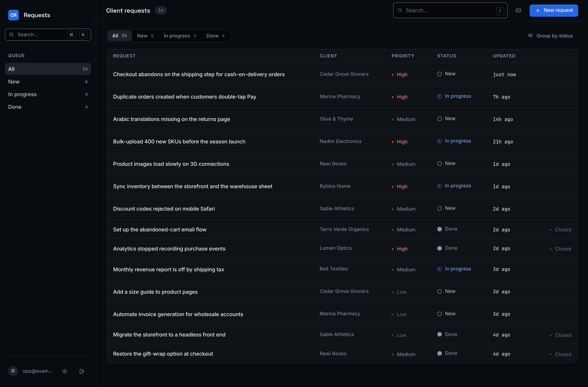
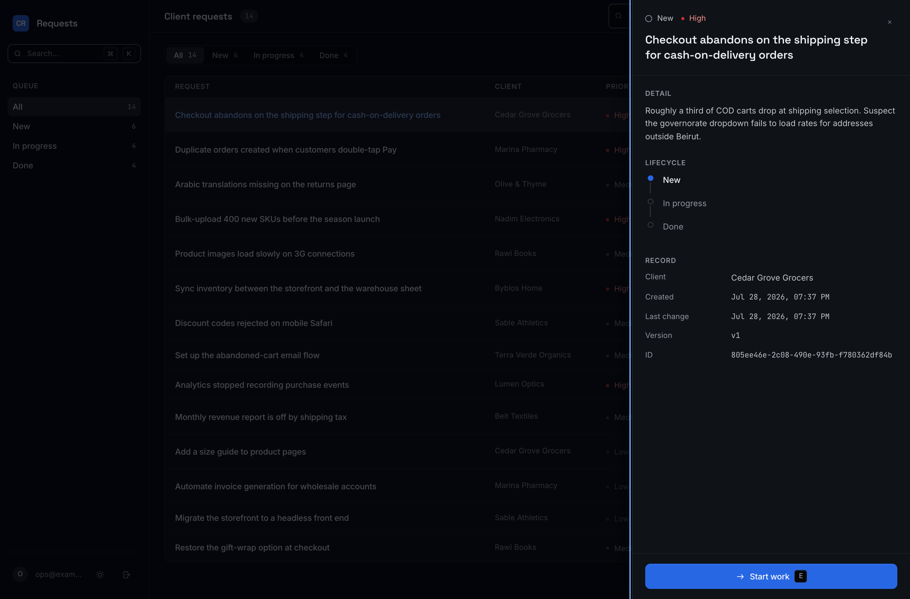

# Client Requests

An internal dashboard for tracking incoming client work: what came in, who it is for,
and where it stands. React + TypeScript on the front, Express + Postgres behind it.

Keyboard-first, dark by default, with a light theme that follows your OS until you
choose otherwise.



<table>
<tr>
<td width="50%"></td>
<td width="50%"></td>
</tr>
<tr>
<td><code>⌘K</code> — commands, filters, and every loaded request</td>
<td>The full record, including the version the conflict check compares</td>
</tr>
</table>

---

## Quick start

Two paths, depending on whether you already run Postgres locally. Either way you are
looking at the app in about two minutes.

### With Docker (nothing to install)

```bash
git clone https://github.com/Ahmad-Zeid/client-requests-dashboard.git
cd client-requests-dashboard
docker compose up -d          # Postgres on :5433
npm install
cp server/.env.example server/.env
npm run db:migrate
npm run db:seed
npm run dev
```

### With a local Postgres

```bash
createdb client_requests
cp server/.env.example server/.env
```

Then edit one line in `server/.env` to point at your instance — for a Homebrew
install that is:

```
DATABASE_URL=postgresql://YOUR_USERNAME@localhost:5432/client_requests
```

and carry on:

```bash
npm install
npm run db:migrate
npm run db:seed
npm run dev
```

**Open http://localhost:5173** and sign in with the seeded account:

| Email             | Password   |
| ----------------- | ---------- |
| `ops@example.com` | `demo1234` |

The API runs on `:4000`; Vite proxies `/api` to it, so there is no CORS setup and no
base URL to configure.

### Scripts

| Command              | What it does                                       |
| -------------------- | -------------------------------------------------- |
| `npm run dev`        | Both apps, one terminal                             |
| `npm test`           | Backend test suite (needs a `_test` database, below)|
| `npm run typecheck`  | `tsc --noEmit` across both workspaces               |
| `npm run db:migrate` | Apply pending migrations                            |
| `npm run db:seed`    | Replace all rows with the demo set                  |
| `npm run db:reset`   | Drop, migrate, seed                                 |
| `npm run build`      | Production build of both                            |

Tests run against a separate database so they never touch your dev data. Create it
once with `createdb client_requests_test` (or
`docker compose exec postgres createdb -U postgres client_requests_test`); the name is
derived from `DATABASE_URL` automatically.

Built and tested on Node 26; anything from Node 20 up will work.

---

## The interface

Everything is reachable without a mouse. `?` opens the full sheet in-app.

| Key | Action |
| --- | --- |
| `⌘K` / `Ctrl K` | Command palette — actions, filters, and jump-to-request |
| `/` | Search |
| `C` | New request |
| `J` `K` | Move the selection |
| `↵` | Open the selected request |
| `E` | Advance the selected request |
| `1`–`4` | Filter by status |
| `?` | Shortcut sheet |

The palette follows the Linear / Raycast pattern: it opens instantly with no entrance
animation, the input keeps focus throughout, and the *highlight* moves between rows
while the rows themselves stay put — an animated list is disorienting to arrow through.

Single-key shortcuts yield to whatever you are typing into. Without that guard, typing
"check" into the search box would fire `C`, `E` and `K` on the way past; it is the
difference between a keyboard system and a keyboard bug.

Theme is dark by default, follows `prefers-color-scheme` on first visit, and stores your
choice once you make one. A tiny inline script in `index.html` applies it before first
paint — otherwise every load flashes the wrong theme, which is the most obvious
"unfinished" tell a themed app can have.

## How it is put together

```
├── server/
│   └── src/
│       ├── config/env.ts          zod-validated environment, checked at boot
│       ├── db/                    pool · migration runner · migrations · seed
│       ├── middleware/            requestId · requireAuth · errorHandler
│       ├── lib/                   ApiError · logger
│       └── modules/
│           ├── auth/              mock login, real signed tokens
│           └── requests/          routes → controller → service → repository
└── client/
    └── src/
        ├── styles/                design tokens + one stylesheet
        ├── lib/apiClient.ts       the only place fetch is called
        ├── components/            Button · Field · Badge · Toast · StateBlock
        └── features/
            ├── auth/              context · sign-in · route guard
            └── requests/          page · table · status control · dialog · hooks
```

The backend is four layers, and each one only knows about the one below it:

- **routes** — URLs and which middleware guards them
- **controller** — parse and validate input, shape the response. No SQL, no rules.
- **service** — the domain. The status lifecycle lives here.
- **repository** — SQL, and nothing else.

The point of the split is that the interesting logic can be reasoned about on its own.
The status state machine is fifteen lines in `requests.service.ts` with no HTTP or
database noise around it, and the SQL is reviewable without reading past business rules.

### What happens when you click "Start work"

```
click
  └─ RequestsPage.handleAdvance()          reads the row's current version
      └─ useAdvanceStatus.mutate()
          ├─ onMutate                      cancel refetches, snapshot cache,
          │                                write the new status → UI updates now
          ├─ PATCH /api/v1/requests/:id/status
          │     └─ requireAuth             401 if the token is missing or expired
          │     └─ controller              zod-parses body and params
          │     └─ service                 is new → in_progress legal?  422 if not
          │     └─ repository              UPDATE … WHERE id = $1 AND version = $2
          │                                0 rows matched → someone else won → 409
          ├─ onError                       roll back; on 409 write the live row the
          │                                server sent and explain in a toast
          └─ onSettled                     invalidate, refetch, cache matches server
```

---

## API

Base path `/api/v1`. Everything except `/health` and `/auth/login` needs
`Authorization: Bearer <token>`.

| Method  | Path                    | Purpose                                    |
| ------- | ----------------------- | ------------------------------------------ |
| `GET`   | `/health`               | Liveness, including a real database ping   |
| `POST`  | `/auth/login`           | Exchange credentials for a session token   |
| `GET`   | `/auth/me`              | Who the current token belongs to           |
| `GET`   | `/requests`             | Paginated list; filter, search, sort       |
| `GET`   | `/requests/stats`       | Counts per status, for the sidebar         |
| `POST`  | `/requests`             | Create — always starts at `new`            |
| `PATCH` | `/requests/:id/status`  | Advance the status                         |

**List** — `?status=new|in_progress|done&q=<text>&page=1&pageSize=20&sort=createdAt:desc`

```jsonc
{
  "data": [
    {
      "id": "9c1f…",
      "clientName": "Cedar Grove Grocers",
      "title": "Checkout abandons on the shipping step",
      "description": "Roughly a third of COD carts drop…",
      "priority": "high",
      "status": "new",
      "version": 1,
      "createdAt": "2026-07-27T09:14:02.331Z",
      "updatedAt": "2026-07-27T09:14:02.331Z"
    }
  ],
  "pagination": { "page": 1, "pageSize": 20, "total": 14, "totalPages": 1 }
}
```

**Advance status** — the body carries the version you read:

```bash
curl -X PATCH localhost:4000/api/v1/requests/$ID/status \
  -H "authorization: Bearer $TOKEN" -H 'content-type: application/json' \
  -d '{"status":"in_progress","expectedVersion":1}'
```

**Errors** all look the same, and always carry the request id from the response headers:

```jsonc
{
  "error": {
    "code": "INVALID_TRANSITION",
    "message": "A request that is “new” can only move to “in_progress”.",
    "details": { "from": "new", "requested": "done", "allowed": ["in_progress"] }
  },
  "requestId": "e5abf163-79d7-467e-ab16-6fab5094d3e9"
}
```

| Code                  | Status | When                                              |
| --------------------- | ------ | ------------------------------------------------- |
| `VALIDATION_ERROR`    | 400    | Body or query failed schema validation            |
| `UNAUTHORIZED`        | 401    | Missing, malformed, or expired token              |
| `INVALID_CREDENTIALS` | 401    | Wrong email or password                           |
| `NOT_FOUND`           | 404    | No such request, or no such route                 |
| `VERSION_CONFLICT`    | 409    | Someone else changed the row first                |
| `INVALID_TRANSITION`  | 422    | Well-formed, but illegal from the current status  |
| `RATE_LIMITED`        | 429    | Too many sign-in attempts                         |
| `INTERNAL_ERROR`      | 500    | A bug. Details are logged, never returned.        |

---

## Decisions worth explaining

**The status machine lives on the server.** `new → in_progress → done`, forward only,
defined as a table in `requests.service.ts`. The UI reads a copy of it to label the
button, but the server is what enforces it — post `{"status":"done"}` to a brand-new
request with curl and you get a 422. A rule only the client enforces is not a rule the
system actually has.

**`PATCH /requests/:id/status`, not `PUT /requests/:id`.** One field changes, so PATCH.
And a dedicated sub-resource rather than a general-purpose update, because a status
change is a distinct operation with its own rules — it is the only thing about a
request that changes after it is created.

**Every row carries a `version`.** An update has to say which version it read, and the
write is `UPDATE … WHERE id = $1 AND version = $2`. If someone else got there first,
zero rows match and the API returns 409 with the current row attached, so the client
can show the truth without another round trip.

This matters more than it looks. Two people with the same list open, both clicking
"Start work": without the version check the second write silently overwrites the first
and one person's action vanishes with no error anywhere. The check and the write are a
single statement, so there is no read-then-write gap to race through — and it costs no
locks.

**Optimistic updates, with an honest rollback.** The row changes the instant you click
rather than after the round trip. If the server disagrees, the cache rolls back to the
snapshot taken before the mutation, and a 409 additionally writes in the live row the
server returned. There is no success toast — the row already shows the new status, and
announcing it again is noise the user has to dismiss.

**TanStack Query rather than `useState` + `useEffect`.** Server data is not component
state: it is a cache of something that lives elsewhere and can change without us. Query
gives request deduplication, refetch on window focus, `keepPreviousData` so paging does
not blank the table, and one place to express the optimistic-update sequence. Hand-rolling
that is where the stale-data bugs come from.

**Indexes chosen from the query plan, not by reflex.** Two composite indexes matching the
two access patterns the dashboard actually has (filter by status + newest first; newest
first overall). Without them every page load is a sequential scan plus an in-memory sort —
invisible at fourteen rows, not invisible at five hundred thousand.

**Pagination is mandatory, and `pageSize` is capped at 100.** There is no code path that
returns the whole table. An uncapped caller-supplied page size is how one request becomes
an outage.

**Login is mocked; the boundary is not.** No users table and no password hashing — the
brief allowed that. But the token is HMAC-signed and expiring, `requireAuth` verifies it
on every `/requests` route, and a tampered token gets a 401. Swapping in real
authentication touches `auth.tokens.ts` and the login controller; nothing downstream
knows the difference.

**One accent, and the status glyph carries the meaning.** `new` is a hollow ring,
`in_progress` is half-filled, `done` is solid — legible in greyscale and to anyone who
cannot separate the hues, so colour is never the only signal. Priority gets a quiet dot
rather than a second badge column; two identical pill columns side by side flatten the
hierarchy instead of building it.

**Tokens are named for their role, not their value.** `--surface-overlay` means "the
highest layer" in both themes, even though that is a lighter colour in dark and a whiter
one in light. Numbered tokens (`paper-1`, `paper-2`…) invert their meaning between themes
and quietly rot. Two accent tokens exist for the same reason: one colour cannot both
carry white text as a button fill and stay legible as text on a dark canvas.

**Control borders are a separate token from decorative ones.** WCAG 1.4.11 wants 3:1 on
anything needed to *identify a control*; a row divider is decoration and is exempt. One
token for both would either make the dividers shout or leave the inputs unfindable.

---

## Details that are easy to skip

Front end:

- Loading, empty, error, and populated are four separate states, not one spinner.
  Loading is skeleton rows, because the shape of the table is known before the data is.
- Every control is designed for all eight states — default, hover, focus-visible,
  active, disabled, loading, error, success.
- No layout shift on focus: border widths are constant and the focus ring occupies a
  reserved transparent outline, so the box geometry never changes.
- Forms validate on blur and then live, so nobody is told their email is wrong while
  typing the first character. Helper text reserves its line so errors do not push the
  page down.
- Below 768px the table becomes cards — still a real `<table>` in the markup, with each
  cell labelled, rather than a data grid you have to scroll sideways.
- Keyboard-complete: skip link, visible focus rings everywhere, native `<dialog>` for
  the focus trap and Escape handling. Dialogs move focus to the first field, not the
  close button — otherwise a keyboard user's opening move is "cancel".
- Three animation primitives, total: the palette highlight, the drawer slide, and a
  one-shot flash on the row whose status just landed. `prefers-reduced-motion` collapses
  all of them. No `transition-all`, no hover-scale, no overshoot easings.
- Contrast is measured, not eyeballed: every text pair and control boundary is checked
  against WCAG in **both** themes as part of the verification pass.
- Search is debounced, which also removes the out-of-order-response bug where the answer
  to `chec` lands after the answer to `checkout`.

Back end:

- Config validated at boot — a missing variable stops the process with a message naming
  it, rather than surfacing as a confusing runtime failure later.
- Every log line carries a request id, echoed in the `x-request-id` header, so a report
  from a user maps to exactly the right lines.
- Graceful shutdown: stop accepting, drain in-flight requests, close the pool, with a
  10-second backstop.
- `helmet`, a CORS allowlist, a 100kb body cap, and rate limiting on the one
  unauthenticated write.
- Migrations tracked in `schema_migrations`, each applied inside a transaction with its
  own bookkeeping row.
- Parameterised queries throughout.
- Internal errors are logged with their stack and returned as an opaque 500.

---

## Tests

```bash
npm test
```

Ten integration tests through the real HTTP stack and a real Postgres, covering the
parts most worth protecting:

```
auth boundary          401 without a token · 401 on a tampered token
validation             400 with the offending field named
status state machine   new → in_progress → done · rejects skipping · rejects reopening
optimistic concurrency 409 on a stale version, with the live row attached
listing                pagination envelope · status filter
health                 reports database connectivity
```

They are deliberately not mocked. The version compare-and-set, the enum constraint, and
the pagination envelope are exactly the things a mock would paper over.

---

## What I would add next

Named deliberately — these are choices, not omissions:

- **An audit trail.** `request_status_events` recording who moved what and when, written
  in the same transaction as the status change. The current model knows the state but
  not the history.
- **Real authentication.** Users table, hashed passwords, short-lived access tokens with
  refresh, and per-user attribution on requests.
- **Push instead of poll.** Refetch-on-focus covers most of the staleness, but a
  WebSocket or SSE channel would let one person's change appear on everyone's screen
  immediately — and would make the 409 path rare rather than routine.
- **Keyset pagination.** `OFFSET` degrades on deep pages; seeking on `(created_at, id)`
  stays flat. Not worth it at this size, worth it before the table gets large.
- **Error reporting and tracing.** Sentry on both sides, and OpenTelemetry spans so a
  slow request can be attributed to a specific query.
- **CI.** Typecheck, tests, and a production build on every push.
- **Frontend tests.** The optimistic rollback and the conflict path deserve coverage;
  the backend has it and the client does not.
