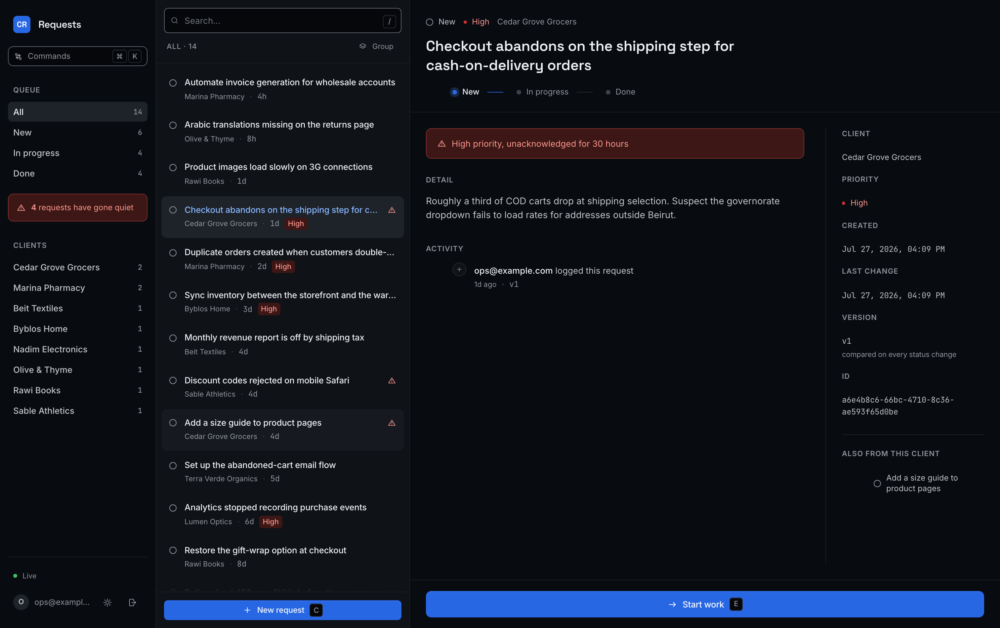
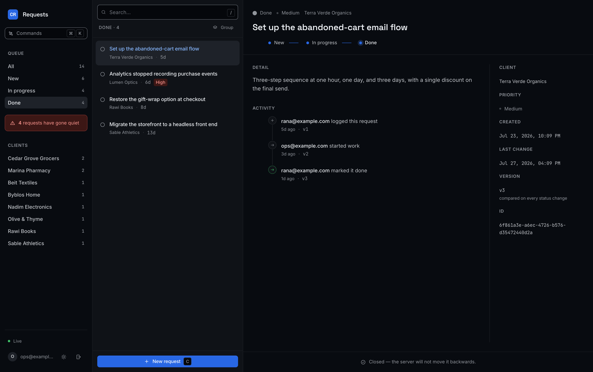
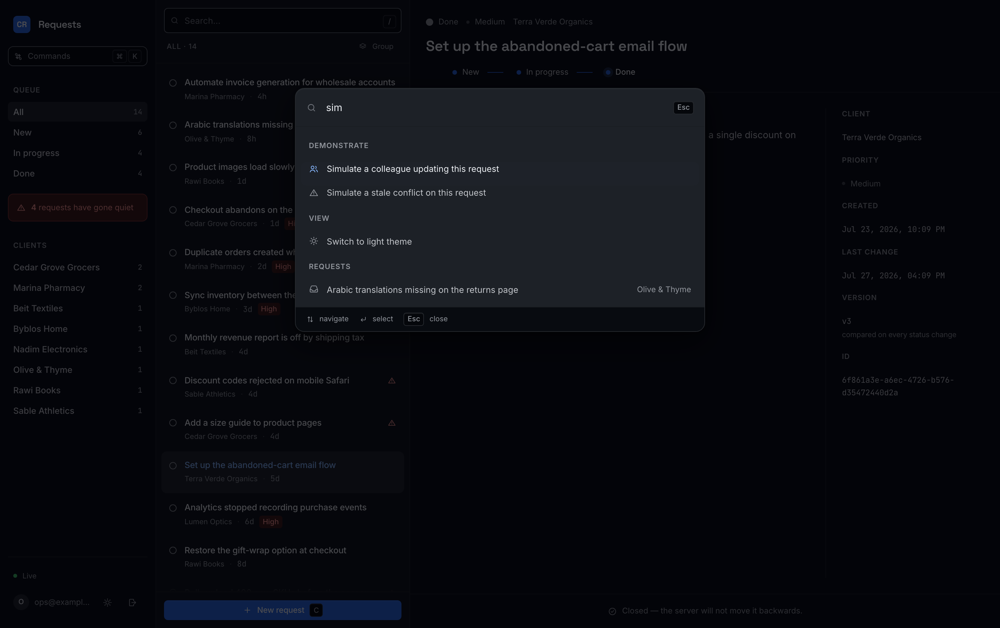
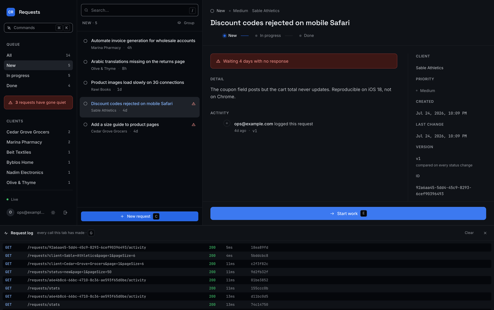
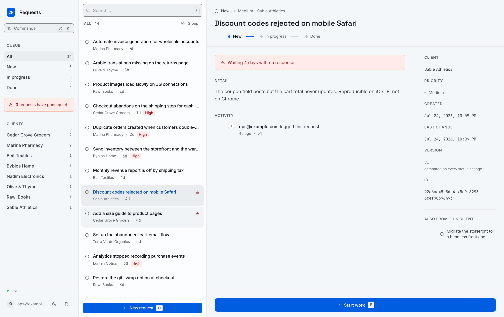

# Client Requests

A triage cockpit for incoming client work: what came in, whose it is, where it stands,
and — the part that matters for an agency — what has gone quiet. React + TypeScript on
the front, Express + Postgres behind it, with changes pushed live over SSE.

Keyboard-first, dark by default, with a light theme that follows your OS until you
choose otherwise.



Three panes rather than a table. The rail is where you choose *what to look at* — by
status, by client, or by what the server has flagged as neglected. The queue is a dense
list you walk with `j`/`k`. The detail pane updates as you move, with no modal and no
round trip, so reading through fourteen requests is fourteen keystrokes.

<table>
<tr>
<td width="50%"></td>
<td width="50%"></td>
</tr>
<tr>
<td>Every status change, who made it, and the version it produced</td>
<td><code>⌘K</code> — fuzzy-matched commands, clients, and every loaded request</td>
</tr>
<tr>
<td></td>
<td></td>
</tr>
<tr>
<td><code>G</code> — every API call this tab has made, with timings and request ids</td>
<td>The same interface in light</td>
</tr>
</table>

---

## Quick start

Two paths, depending on whether you already run Postgres locally. Either way you are
looking at the app in about two minutes.

### With Docker (nothing to install)

```bash
git clone https://github.com/Ahmad-Zeid/client-requests-dashboard.git
cd client-requests-dashboard
docker compose up -d          # Postgres on :5433
npm install
cp server/.env.example server/.env
npm run db:migrate
npm run db:seed
npm run dev
```

### With a local Postgres

```bash
createdb client_requests
cp server/.env.example server/.env
```

Then edit one line in `server/.env` to point at your instance — for a Homebrew
install that is:

```
DATABASE_URL=postgresql://YOUR_USERNAME@localhost:5432/client_requests
```

and carry on:

```bash
npm install
npm run db:migrate
npm run db:seed
npm run dev
```

**Open http://localhost:5173** and sign in with the seeded account:

| Email             | Password   |
| ----------------- | ---------- |
| `ops@example.com` | `demo1234` |

The API runs on `:4000`; Vite proxies `/api` to it, so there is no CORS setup and no
base URL to configure. Open a second window side by side and advance something in one —
the other updates without a refresh.

To see the concurrency handling without arranging a race yourself, press `⌘K` and look
under **Demonstrate**.

### Scripts

| Command              | What it does                                       |
| -------------------- | -------------------------------------------------- |
| `npm run dev`        | Both apps, one terminal                             |
| `npm test`           | Backend test suite (needs a `_test` database, below)|
| `npm run typecheck`  | `tsc --noEmit` across both workspaces               |
| `npm run db:migrate` | Apply pending migrations                            |
| `npm run db:seed`    | Replace all rows with the demo set                  |
| `npm run db:reset`   | Drop, migrate, seed                                 |
| `npm run build`      | Production build of both                            |

Tests run against a separate database so they never touch your dev data. Create it
once with `createdb client_requests_test` (or
`docker compose exec postgres createdb -U postgres client_requests_test`); the name is
derived from `DATABASE_URL` automatically.

Built and tested on Node 26; anything from Node 20 up will work.

### Deploying it

Three free tiers — Neon for Postgres, Render for the API, Vercel for the client. Both
deployments are described by files in the repo rather than by fields somebody typed into
a dashboard once: [`render.yaml`](render.yaml) and [`vercel.json`](vercel.json).

**1. Postgres — [Neon](https://neon.tech).** Create a project and copy the *pooled*
connection string. Change `sslmode=require` to `sslmode=verify-full` in it: that is what
node-postgres does today regardless, and saying so avoids a deprecation warning on every
boot. Then seed it once from your machine — Render's pre-deploy step handles migrations
from then on.

```bash
DATABASE_URL='<neon connection string>' npm run db:migrate
DATABASE_URL='<neon connection string>' npm run db:seed
```

**2. API — [Render](https://render.com).** *New → Blueprint*, point it at the repo. It
reads `render.yaml` and prompts for the three secrets:

| Variable | Value |
| --- | --- |
| `DATABASE_URL` | the Neon string from step 1 |
| `AUTH_SECRET` | `openssl rand -base64 32` — not the example one |
| `CORS_ORIGIN` | the Vercel URL from step 3; put a placeholder in for now |

**3. Client — [Vercel](https://vercel.com).** Import the repo and leave the root
directory at the repo root — `vercel.json` names the workspace build, so there is no
monorepo detection to get wrong. One environment variable:

```
VITE_API_BASE_URL=https://<your-render-service>.onrender.com/api/v1
```

**4.** Set `CORS_ORIGIN` on Render to the Vercel URL and redeploy. Done.

Two things worth knowing. Render's free tier sleeps after fifteen minutes idle, so the
first request after a quiet spell takes about thirty seconds — after which the event
stream reconnects on its own. And `DEMO_MODE=true` puts *Reset the demo data* in the
palette, so the first visitor who marks everything done cannot spoil it for the next.

Why the configuration is shaped the way it is:

- **Migrations are a pre-deploy step, not a boot step.** On one instance the difference
  is invisible; on two it is the difference between one migration and a race between
  replicas. The runner is idempotent either way, which is what makes the weaker option
  tempting and the stronger one free.
- **The health check pings the database.** A process that is up but cannot reach Postgres
  is not healthy, it only looks healthy to a naive probe.
- **`vercel.json` rewrites everything to `index.html`.** `/requests` is a React Router
  path, not a file. Without the rewrite, opening it directly — or refreshing on it — is a
  404 from the host, and the app looks broken to anyone who does not enter through the
  front door.
- **`npm run build` copies `src/db/migrations` into `dist`.** `tsc` does not emit `.sql`,
  so the compiled server would otherwise reach production with no migrations to run.

The whole arrangement is rehearsed locally before it is deployed — the built client on
one origin, the compiled API on another with `NODE_ENV=production` and a CORS allowlist.
That is what catches the failures which only exist once the two are not the same origin:
CORS, helmet's cross-origin headers, `EventSource` across origins, and SPA deep links.

---

## The interface

Everything is reachable without a mouse. `?` opens the full sheet in-app.

| Key | Action |
| --- | --- |
| `⌘K` / `Ctrl K` | Command palette — toggles, so the same key closes it |
| `J` `K` | Move through the queue; the detail pane follows |
| `H` `L` | Move focus between panes |
| `E` | Advance the selected request |
| `/` | Search |
| `C` | New request |
| `1`–`4` | Filter by status |
| `5` | Only what needs attention |
| `G` | Show the live request log |
| `Esc` | Widen: clear the search, then the filters |
| `?` | Shortcut sheet |

Vertical for items, horizontal for panes. That is the vim spatial model, and it is worth
having only because there *are* panes to move between — it is the reason the layout and
the keyboard scheme were designed together rather than one bolted onto the other.

The palette follows the Linear / Raycast pattern: it opens instantly with no entrance
animation, the input keeps focus throughout, and the *highlight* moves between rows
while the rows themselves stay put — an animated list is disorienting to arrow through.
Matching is subsequence-based and scored, so "sim conf" finds "Simulate a stale
conflict", and every command shows its shortcut — the palette is also how people learn
the keys and stop needing the palette.

Single-key shortcuts yield to whatever you are typing into. Without that guard, typing
"check" into the search box would fire `C`, `E` and `K` on the way past; it is the
difference between a keyboard system and a keyboard bug.

Theme is dark by default, follows `prefers-color-scheme` on first visit, and stores your
choice once you make one. A tiny inline script in `index.html` applies it before first
paint — otherwise every load flashes the wrong theme, which is the most obvious
"unfinished" tell a themed app can have.

## How it is put together

```
├── server/
│   └── src/
│       ├── config/env.ts          zod-validated environment, checked at boot
│       ├── db/                    pool · migration runner · migrations · seed
│       ├── middleware/            requestId · requireAuth · errorHandler
│       ├── lib/                   ApiError · logger · eventBus
│       └── modules/
│           ├── auth/              mock login, real signed tokens
│           ├── events/            SSE stream · single-use stream tickets
│           ├── demo/              env-gated reset, so a public demo survives visitors
│           └── requests/          routes → controller → service → repository
│                                  + attention rules, shared by JS and SQL
└── client/
    └── src/
        ├── styles/                design tokens + one stylesheet
        ├── lib/apiClient.ts       the only place fetch is called
        ├── components/            Button · Field · Badge · Toast · RequestLog
        └── features/
            ├── auth/              context · sign-in · route guard
            ├── command/           palette + subsequence scoring
            ├── events/            useEventStream — SSE into the query cache
            └── requests/          page · list · detail · dialog · hooks
```

The backend is four layers, and each one only knows about the one below it:

- **routes** — URLs and which middleware guards them
- **controller** — parse and validate input, shape the response. No SQL, no rules.
- **service** — the domain. The status lifecycle lives here.
- **repository** — SQL, and nothing else.

The point of the split is that the interesting logic can be reasoned about on its own.
The status state machine is fifteen lines in `requests.service.ts` with no HTTP or
database noise around it, and the SQL is reviewable without reading past business rules.

### What happens when you click "Start work"

```
click
  └─ RequestsPage.advance()                reads the row's current version
      └─ useAdvanceStatus.mutate()
          ├─ onMutate                      cancel refetches, snapshot cache,
          │                                write the new status → UI updates now
          ├─ PATCH /api/v1/requests/:id/status
          │     └─ requireAuth             401 if the token is missing or expired
          │     └─ controller              zod-parses body and params; takes the
          │                                actor from the session, not the body
          │     └─ service                 stale version?           → 409
          │                                is new → in_progress legal?  422 if not
          │     └─ repository              one statement:
          │                                  UPDATE … WHERE id = $1 AND version = $2
          │                                  + INSERT the event, reading from it
          │                                0 rows matched → someone else won → 409,
          │                                and no history is written
          │     └─ service                 publish `request.updated` — after commit,
          │                                never before
          │                                   └─ SSE → every other connected tab,
          │                                      which patches that one row in place
          ├─ onError                       roll back; on 409 write the live row the
          │                                server sent and explain in a toast
          └─ onSettled                     invalidate, refetch, cache matches server
```

---

## API

Base path `/api/v1`. Everything except `/health` and `/auth/login` needs
`Authorization: Bearer <token>`.

| Method  | Path                     | Purpose                                          |
| ------- | ------------------------ | ------------------------------------------------ |
| `GET`   | `/health`                | Liveness, including a real database ping         |
| `POST`  | `/auth/login`            | Exchange credentials for a session token         |
| `GET`   | `/auth/me`               | Who the current token belongs to                 |
| `GET`   | `/requests`              | Paginated list; filter, search, sort             |
| `GET`   | `/requests/stats`        | Counts per status and per client, for the rail   |
| `GET`   | `/requests/:id/activity` | That request's trail, oldest first               |
| `POST`  | `/requests`              | Create — always starts at `new`                  |
| `PATCH` | `/requests/:id/status`   | Advance the status                               |
| `POST`  | `/events/ticket`         | Exchange the session token for a stream ticket   |
| `GET`   | `/events?ticket=…`       | Server-Sent Events: `request.created`/`.updated` |
| `POST`  | `/demo/reset`            | Reseed. Only mounted when `DEMO_MODE=true`.      |

**List** — `?status=new|in_progress|done&attention=true&client=<name>&q=<text>&page=1&pageSize=20`

```jsonc
{
  "data": [
    {
      "id": "9c1f…",
      "clientName": "Cedar Grove Grocers",
      "title": "Checkout abandons on the shipping step",
      "description": "Roughly a third of COD carts drop…",
      "priority": "high",
      "status": "new",
      "version": 1,
      "createdAt": "2026-07-27T09:14:02.331Z",
      "updatedAt": "2026-07-27T09:14:02.331Z",

      // Derived on every read, never stored — it is a function of the clock, so a
      // stored copy would be wrong the moment nobody wrote to the row.
      "attention": {
        "reason": "unacknowledged_high",
        "label": "High priority, unacknowledged for 30 hours",
        "hours": 30
      }
    }
  ],
  "pagination": { "page": 1, "pageSize": 20, "total": 14, "totalPages": 1 }
}
```

**Advance status** — the body carries the version you read:

```bash
curl -X PATCH localhost:4000/api/v1/requests/$ID/status \
  -H "authorization: Bearer $TOKEN" -H 'content-type: application/json' \
  -d '{"status":"in_progress","expectedVersion":1}'
```

**Errors** all look the same, and always carry the request id from the response headers:

```jsonc
{
  "error": {
    "code": "INVALID_TRANSITION",
    "message": "A request that is “new” can only move to “in_progress”.",
    "details": { "from": "new", "requested": "done", "allowed": ["in_progress"] }
  },
  "requestId": "e5abf163-79d7-467e-ab16-6fab5094d3e9"
}
```

| Code                  | Status | When                                              |
| --------------------- | ------ | ------------------------------------------------- |
| `VALIDATION_ERROR`    | 400    | Body or query failed schema validation            |
| `UNAUTHORIZED`        | 401    | Missing, malformed, or expired token              |
| `INVALID_CREDENTIALS` | 401    | Wrong email or password                           |
| `NOT_FOUND`           | 404    | No such request, or no such route                 |
| `VERSION_CONFLICT`    | 409    | Someone else changed the row first                |
| `INVALID_TRANSITION`  | 422    | Well-formed, but illegal from the current status  |
| `RATE_LIMITED`        | 429    | Too many sign-in attempts                         |
| `INTERNAL_ERROR`      | 500    | A bug. Details are logged, never returned.        |

---

## Decisions worth explaining

**The status machine lives on the server.** `new → in_progress → done`, forward only,
defined as a table in `requests.service.ts`. The UI reads a copy of it to label the
button, but the server is what enforces it — post `{"status":"done"}` to a brand-new
request with curl and you get a 422. A rule only the client enforces is not a rule the
system actually has.

**`PATCH /requests/:id/status`, not `PUT /requests/:id`.** One field changes, so PATCH.
And a dedicated sub-resource rather than a general-purpose update, because a status
change is a distinct operation with its own rules — it is the only thing about a
request that changes after it is created.

**Every row carries a `version`.** An update has to say which version it read, and the
write is `UPDATE … WHERE id = $1 AND version = $2`. If someone else got there first,
zero rows match and the API returns 409 with the current row attached, so the client
can show the truth without another round trip.

This matters more than it looks. Two people with the same list open, both clicking
"Start work": without the version check the second write silently overwrites the first
and one person's action vanishes with no error anywhere. The check and the write are a
single statement, so there is no read-then-write gap to race through — and it costs no
locks.

**The product has an opinion, and it lives on the server.** Every request in a flat
queue is equal, which is exactly the failure mode of an agency queue — the thing that
hurts is not volume, it is a request nobody has answered. Three rules in
`requests.attention.ts` say what neglect looks like: a high-priority request
unacknowledged for a day, anything waiting three days, work started and untouched for
five. The thresholds are named constants used twice — once by the JavaScript that
decorates each row, once by the SQL fragment that powers `?attention=true` and the
count. One source, two consumers, so the filter and the badge can never disagree.

It surfaces as a sentence — "4 requests have gone quiet" — rather than a stat card.
Everyone ships stat cards and nobody reads them.

**An append-only trail, written in the same statement as the change.** `client_requests`
holds the current state; `request_events` holds how it got there — who, when, from what
to what, and which version the write produced. The insert is a data-modifying CTE
attached to the `UPDATE`, so there is no window where a status change exists without its
history, and a compare-and-set that *loses* writes no history at all. The actor comes
from the verified session, never the request body: an actor a client can name is an
actor a client can forge, and a trail that records whatever it is told is worse than no
trail because it looks authoritative.

**Live updates over SSE, not WebSockets.** The traffic is entirely one-directional — the
server says what changed, and there is already a perfectly good REST API for writing. A
WebSocket would add a second protocol with its own framing, heartbeats and reconnect
logic to buy a direction that is never used. On `request.updated` the client patches the
matching row in every cached list *surgically* instead of invalidating; on
`request.created` it invalidates, because a new row moves ordering and page boundaries.

**Stream tickets, because `EventSource` cannot send a header.** The usual workaround is
`?token=<session token>`, which writes an eight-hour credential into every access log,
proxy cache and browser history entry along the way. Instead `POST /events/ticket`
exchanges the bearer token for a **single-use, thirty-second** ticket, and the stream
opens with that. A leaked ticket is worth nothing: it has already been spent. About
twenty-five lines, and it is the difference between a demo and something you could
deploy.

**Timestamps are normalised in the driver.** Postgres writes
`2026-07-23 21:19:37.119764+03` — a space instead of `T`, and an offset with no minutes.
`Date` is not required to parse that: V8 does, which is why it looks fine in Chrome and
in Node, and Safari returns `Invalid Date`. One `toISOString()` in the type parser fixes
it once for every timestamp in the system, rather than in each place that happens to
render one. A bug that appears on one engine, in a field nobody thinks of as parsed, is
exactly the kind that reaches production.

**The strongest engineering here is invisible, so there is a way to see it.** A
*Demonstrate* group in the palette fires a genuine second-session write. "Simulate a
colleague" lets the update arrive over the stream and watch the row change in front of
you. "Simulate a stale conflict" makes the same write but withholds the live update for
that one row, so this client is *genuinely* stale and the next advance produces a real
409 from a real version mismatch. Nothing about the server is faked; the only trick is
withholding a refresh, which is precisely the state a backgrounded tab is in. `G` opens
a log of every call the tab has made, with status, duration and the request id that
matches the server's logs.

**Optimistic updates, with an honest rollback.** The row changes the instant you click
rather than after the round trip. If the server disagrees, the cache rolls back to the
snapshot taken before the mutation, and a 409 additionally writes in the live row the
server returned. There is no success toast — the row already shows the new status, and
announcing it again is noise the user has to dismiss.

**TanStack Query rather than `useState` + `useEffect`.** Server data is not component
state: it is a cache of something that lives elsewhere and can change without us. Query
gives request deduplication, refetch on window focus, `keepPreviousData` so paging does
not blank the table, and one place to express the optimistic-update sequence. Hand-rolling
that is where the stale-data bugs come from.

**Indexes chosen from the query plan, not by reflex.** Two composite indexes matching the
two access patterns the dashboard actually has (filter by status + newest first; newest
first overall). Without them every page load is a sequential scan plus an in-memory sort —
invisible at fourteen rows, not invisible at five hundred thousand.

**Pagination is mandatory, and `pageSize` is capped at 100.** There is no code path that
returns the whole table. An uncapped caller-supplied page size is how one request becomes
an outage.

**Login is mocked; the boundary is not.** No users table and no password hashing — the
brief allowed that. But the token is HMAC-signed and expiring, `requireAuth` verifies it
on every `/requests` route, and a tampered token gets a 401. Swapping in real
authentication touches `auth.tokens.ts` and the login controller; nothing downstream
knows the difference.

**One accent, and the status glyph carries the meaning.** `new` is a hollow ring,
`in_progress` is half-filled, `done` is solid — legible in greyscale and to anyone who
cannot separate the hues, so colour is never the only signal. Priority gets a quiet dot
rather than a second badge column; two identical pill columns side by side flatten the
hierarchy instead of building it.

**Tokens are named for their role, not their value.** `--surface-overlay` means "the
highest layer" in both themes, even though that is a lighter colour in dark and a whiter
one in light. Numbered tokens (`paper-1`, `paper-2`…) invert their meaning between themes
and quietly rot. Two accent tokens exist for the same reason: one colour cannot both
carry white text as a button fill and stay legible as text on a dark canvas.

**Control borders are a separate token from decorative ones.** WCAG 1.4.11 wants 3:1 on
anything needed to *identify a control*; a row divider is decoration and is exempt. One
token for both would either make the dividers shout or leave the inputs unfindable.

---

## Details that are easy to skip

Front end:

- Loading, empty, error, and populated are four separate states, not one spinner.
  Loading is skeleton rows, because the shape of the table is known before the data is.
- Every control is designed for all eight states — default, hover, focus-visible,
  active, disabled, loading, error, success.
- No layout shift on focus: border widths are constant and the focus ring occupies a
  reserved transparent outline, so the box geometry never changes.
- Forms validate on blur and then live, so nobody is told their email is wrong while
  typing the first character. Helper text reserves its line so errors do not push the
  page down.
- The layout degrades in two steps, not one: below 1100px the detail pane becomes an
  overlay over the queue; below 860px the rail folds into a top bar. Both paths reuse the
  same components, so there is no second implementation to keep in sync.
- The selection is validated against the list rather than merely set. Switching filters
  keeps the previous page on screen while the next loads, so a naive "select the first
  row" grabs one from the list that is about to be replaced — and lands on an id nothing
  matches, leaving an empty pane beside a full queue with no state change left to fix it.
- Keyboard-complete: skip link, visible focus rings everywhere, native `<dialog>` for
  the focus trap and Escape handling. Dialogs move focus to the first field, not the
  close button — otherwise a keyboard user's opening move is "cancel".
- Three animation primitives, total: the palette highlight, the drawer slide, and a
  one-shot flash on the row whose status just landed. `prefers-reduced-motion` collapses
  all of them. No `transition-all`, no hover-scale, no overshoot easings.
- Contrast is measured, not eyeballed: every text pair and control boundary is checked
  against WCAG in **both** themes as part of the verification pass.
- Search is debounced, which also removes the out-of-order-response bug where the answer
  to `chec` lands after the answer to `checkout`.

Back end:

- Config validated at boot — a missing variable stops the process with a message naming
  it, rather than surfacing as a confusing runtime failure later.
- Every log line carries a request id, echoed in the `x-request-id` header, so a report
  from a user maps to exactly the right lines.
- Graceful shutdown: stop accepting, drain in-flight requests, close the pool, with a
  10-second backstop.
- `helmet`, a CORS allowlist, a 100kb body cap, and rate limiting on the one
  unauthenticated write.
- Migrations tracked in `schema_migrations`, each applied inside a transaction with its
  own bookkeeping row.
- The SSE endpoint sends a comment heartbeat every 25 seconds, so an idle connection is
  not silently reaped by a proxy, and shutdown closes open streams first — without that
  the process ignores `SIGTERM` and waits for a timeout that never comes.
- Parameterised queries throughout.
- Internal errors are logged with their stack and returned as an opaque 500.

---

## Tests

```bash
npm test
```

Twenty-one integration tests through the real HTTP stack and a real Postgres, covering
the parts most worth protecting:

```
auth boundary          401 without a token · 401 on a tampered token
validation             400 with the offending field named
status state machine   new → in_progress → done · rejects skipping · rejects reopening
optimistic concurrency 409 on a stale version, with the live row attached
activity trail         one entry per write · actor from the session · nothing on a
                       lost compare-and-set · 404 for a request that does not exist
attention rules        each reason fires on known-age rows; the SQL count and the
                       JavaScript predicate agree
client scoping         list narrows to one client · stats count open work per client
stream tickets         401 unauthenticated · opens a stream once · rejected on reuse
                       and when forged
listing                pagination envelope · status filter
health                 reports database connectivity
```

They are deliberately not mocked. The version compare-and-set, the enum constraint, and
the pagination envelope are exactly the things a mock would paper over.

The UI has its own suite, driven through Playwright against the running stack: fifty-one
behavioural checks (optimistic update with the response held open, the conflict path,
the keyboard model, live sync between two real browser contexts, ticket reuse) plus a
contrast and responsive pass that measures every text pair and control boundary against
WCAG in **both** themes at five widths.

---

## What I would add next

Named deliberately — these are choices, not omissions:

- **Real authentication.** Users table, hashed passwords, short-lived access tokens with
  refresh. The trail already records an actor per write, so it would gain real identities
  rather than a new column.
- **The event bus should not be in-process.** `eventBus.ts` broadcasts to the responses
  held by *this* process. Run two instances behind a load balancer and a change made on
  one is invisible to everyone connected to the other. Redis pub/sub between the writer
  and the streams is the fix, and it is the first thing that breaks on a second replica.
- **Assignment.** Requests belong to a client but not yet to a person, so "gone quiet"
  cannot become "gone quiet on *you*" — which is the version of that signal people act on.
- **Keyset pagination.** `OFFSET` degrades on deep pages; seeking on `(created_at, id)`
  stays flat. Not worth it at this size, worth it before the table gets large.
- **Error reporting and tracing.** Sentry on both sides, and OpenTelemetry spans so a
  slow request can be attributed to a specific query.
- **CI.** Typecheck, tests, and a production build on every push.
- **Frontend tests.** The optimistic rollback and the conflict path deserve coverage;
  the backend has it and the client does not.
